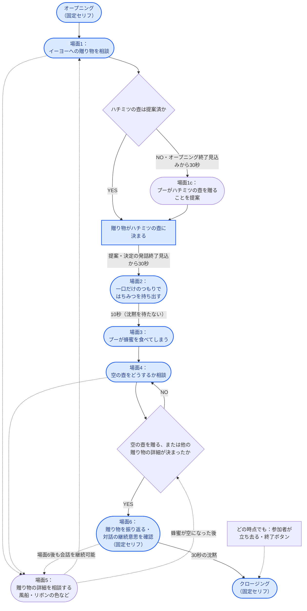

# イーヨーの誕生日シナリオの流れ

`eeyore_birthday` シナリオで想定している流れ。四角は状態、角丸は場面・イベント（開始・終了を含む）、
ひし形は Python が状態で判定する分岐を表す。青は物語の必須の場面・到達点を表す。
場面1cは未提案の場合だけ通る経路であり、必須なのは「プーの贈り物がハチミツの壺に決まる」こと。
場面ID（1a など）は表示とログ用の目安で、流れの制御には使わない。
実線は主な進行、点線は任意の会話や途中終了を表す。
秒数は `scripts/scenarios.py` の既定値で、発火には下記の会話待ちも適用される。



場面5の詳細相談は蜂蜜を食べる前にも、締めの後にも起こる。必ず場面4→5→6と通るわけではない。
締めの判定は `give_empty_jar` または蜂蜜が空になった後の `settled_details` の記録で成立し、
`not_give_empty_jar` は必須条件ではない。`story_wrap_up` は一度だけ発火する。
未提案時の自動決定の期限はオープニングの発話終了見込みから数え、会話のたびにはリセットしない。

2026-09-26に旧場面6（詳細相談）を5、旧場面5（振り返り）を6へ変更した。
過去ログの場面IDは書き換えていないため、古いログを読む際は旧番号として扱う。

## 時間イベントの割り込み方

- 場面の始まりになるイベント（`honey_gift_committed`、`pooh_tastes_honey`、`story_wrap_up`）は
  期限が来ても会話に割り込まない。最後のやり取りから12秒の沈黙で単独で発火するか、参加者が
  話し続けた場合は、期限後の最初の返事に続けて「あ、そういえば。」などのつなぎで発火する。
- プーの返事が参加者への問いかけで終わっているときは、返事に続けては発火せず、沈黙は
  30秒まで待つ。
- `pooh_ate_honey` は持ち出しと一続きの場面なので、沈黙を待たずに10秒で発火する。
- `idle_close_after_wrap_up` は返事に続けては発火しない。話し続ける参加者は会話を続けられる。

詳しい規則は [timed_narrative_events.md](timed_narrative_events.md) を参照。

## 図を表示・出力する

ブラウザで確認する場合は [Mermaid Live Editor](https://mermaid.live/) に上の
`flowchart TD` から `class` 行までを貼り付ける（Markdownのコードフェンスは除く）。

このPCでは `package-lock.json` に従ってMermaid CLIを導入済み。
システムのNode.jsが古いため、Node.js 22で起動する。プロジェクトのルートで以下を実行すると、
このMarkdownから図を読み、Git管理外の `.tools/` にPNGを出力できる。

```bash
awk '/^```mermaid/{inside=1;next} /^```/{inside=0} inside' docs/eeyore_scenario_flow.md |
  npx -p node@22 -c 'node node_modules/@mermaid-js/mermaid-cli/src/cli.js -i - -o .tools/eeyore_scenario_flow.png -p .tools/mermaid-puppeteer.json -b white -s 2'
```

横向き（LR）も保存する場合は、描画時だけ向きを置き換えて別名で出力する。
元の図と縦向きPNGは変更しない。

```bash
awk '/^```mermaid/{inside=1;next} /^```/{inside=0} inside' docs/eeyore_scenario_flow.md |
  sed 's/^flowchart TD$/flowchart LR/' |
  npx -p node@22 -c 'node node_modules/@mermaid-js/mermaid-cli/src/cli.js -i - -o .tools/eeyore_scenario_flow_lr.png -p .tools/mermaid-puppeteer.json -b white -s 2'
```

出力名の拡張子を `.svg` または `.pdf` にすると、それぞれの形式で出力する。
`.tools/mermaid-puppeteer.json` はこのPCのChromeを指定したローカル設定で、別PCでは準備が必要。
通常のNode.js 22環境では `npm ci` で導入し、`npx mmdc` から実行できる。
